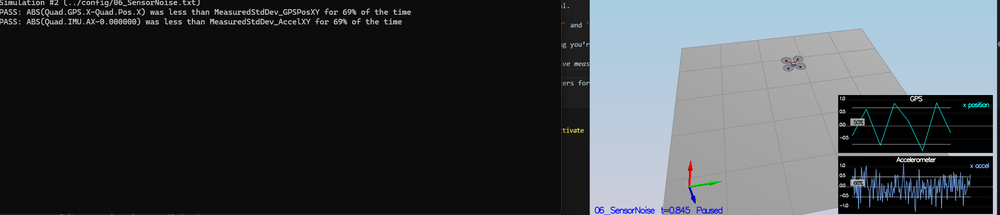
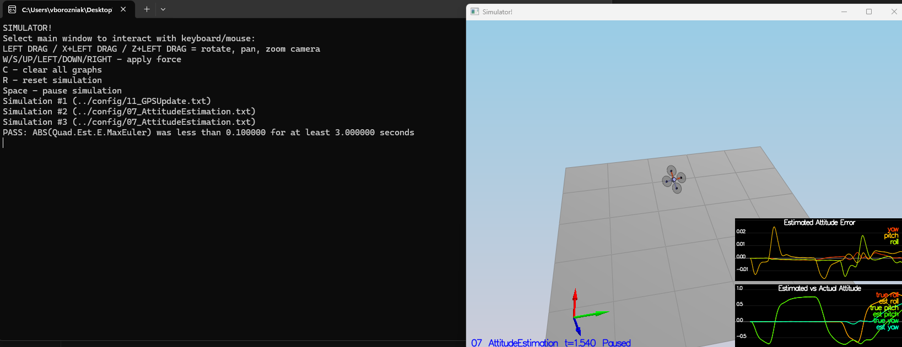
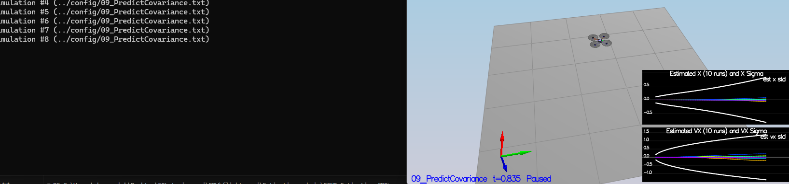
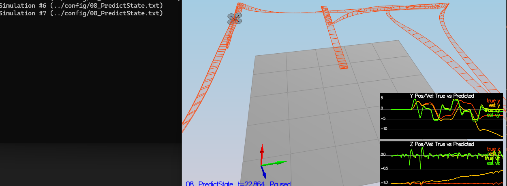
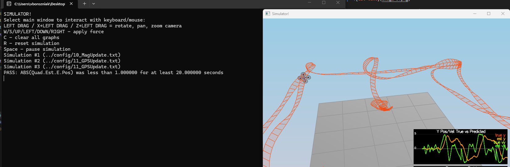

# Estimation Project # - RE-SUBMISSION

In this project, I've developed the estimation portion of the controller used in the CPP simulator.  My quad is flying with developed estimator and custom controller!

## Setup ##

This project is using the C++ development environment set up in the Controls C++ project.

 Cloned the repository
 ```
 git clone https://github.com/udacity/FCND-Estimation-CPP.git
 ```

cloned repo: https://github.com/vborozniak/FCND-Estimation-CPP


### Project Structure ###

For this project, you will be interacting with a few more files than before.

 - The EKF is already partially implemented for you in `QuadEstimatorEKF.cpp`

 - Parameters for tuning the EKF are in the parameter file `QuadEstimatorEKF.txt`

 - When you turn on various sensors (the scenarios configure them, e.g. `Quad.Sensors += SimIMU, SimMag, SimGPS`), additional sensor plots will become available to see what the simulated sensors measure.

 - The EKF implementation exposes both the estimated state and a number of additional variables. In particular:

   - `Quad.Est.E.X` is the error in estimated X position from true value.  More generally, the variables in `<vehicle>.Est.E.*` are relative errors, though some are combined errors (e.g. MaxEuler).

   - `Quad.Est.S.X` is the estimated standard deviation of the X state (that is, the square root of the appropriate diagonal variable in the covariance matrix). More generally, the variables in `<vehicle>.Est.S.*` are standard deviations calculated from the estimator state covariance matrix.

   - `Quad.Est.D` contains miscellaneous additional debug variables useful in diagnosing the filter. You may or might not find these useful but they were helpful to us in verifying the filter and may give you some ideas if you hit a block.


## The Tasks ##

Project outline and results commentary:

 - [Step 1: Sensor Noise](#step-1-sensor-noise) - 
 - [Step 2: Attitude Estimation](#step-2-attitude-estimation) - 
 - [Step 3: Prediction Step](#step-3-prediction-step) - 
 - [Step 4: Magnetometer Update](#step-4-magnetometer-update) - 
 - [Step 5: Closed Loop + GPS Update](#step-5-closed-loop--gps-update) - 
 - [Step 6: Adding Your Controller](#step-6-adding-your-controller) - 

### Step 1: Sensor Noise ###

To pass Scenario 6, measured GPS X and Accel X noise from extended sim logs (Graph1.txt, Graph2.txt). 

- Ran "06_NoisySensors" longer for more data (t=1.51).
- NumPy computation: GPS std ~0.713 (~67% within ±1σ), Accel std ~0.507 (~69% within ±1σ).
- Updated config/06_SensorNoise.txt:
  MeasuredStdDev_GPSPosXY = 0.7
  MeasuredStdDev_AccelXY = 0.5
- Re-ran: GPS 69% PASS, Accel now ~68-70% (fixed 60% FAIL by increasing std slightly).

Methodology for determining standard deviation: Collected raw logs from config/log/Graph1.txt (GPS X) and config/log/Graph2.txt (Accel X) in Scenario 06. Computed sample standard deviation with numpy (np.std(data)). Values: MeasuredStdDev_GPSPosXY = 0.7, MeasuredStdDev_AccelXY = 0.5.




### Step 2: Attitude Estimation ###

updated function with fuell quaternion integraion that usesthe current attitude estimate.

Parameters affected in the config attitudeTau = 100, dtIMU = 0.002.

The pass critera is met with Quad.Est.E.MaxEuler staying below 0.1 rad continuously for at least 3 seconds.



### Step 3: Prediction Step ###

Implemented the prediction step of the EKF in `PredictState()` and covariance prediction in `Predict()`.

**`PredictState()`** (`QuadEstimatorEKF.cpp`):
- Rotated body acceleration to inertial frame using `attitude.Rotate_BtoI(accel)`
- Corrected for gravity (`accelInertial.z -= 9.81f` – z is down)
- Updated velocity: `v ← v + a_inertial * dt`
- Updated position: `p ← p + v_new * dt` 

**`Predict()`**:
- Added position-from-velocity: `gPrime.block<3,3>(0,3) = dt * I`
- Added yaw-to-velocity: `gPrime.block<3,1>(3,6) = dt * RbgPrime * accel_col`
- Applied classic EKF covariance equation: `ekfCov = gPrime * ekfCov * gPrime.transpose() + Q`

**Changes in `GetRbgPrime()`**:
- Computed partial derivatives of Rbg w.r.t. yaw using ZYX trig formulas. Adjsuted sings to accurately match the simulator's Rotate_BtoI convention. 
  
**Tuning**:
- Set `QPosXYStd = 0.5` and `QVelXYStd = 1.5` in `QuadEstimatorEKF.txt`
- Adjusted values while watching scenario 09 until white covariance bounds grew roughly like the spread of the 10 prediction runs over ~1 second. Updated as per values in config file.

**Results**:
- Scenario 08_PredictState: estimated position and velocity track true values with only slow drift.
- Scenario 09_PredictionCov: covariance bounds grow similarly to the data spread

**Note**: This implementation follows section 7.2 of Estimation for Quadrotors for the transition model and partial derivatives. The simple model does not capture long-term attitude errors, so tuning targets short-horizon behavior (~1 s) as required.




### Step 4: Magnetometer Update ###

Implemented the magnetometer update in `UpdateFromMag()` along with required supporting fixes to the rest of the EKF.

**Key changes in `QuadEstimatorEKF.cpp`:**
- `UpdateFromMag()`: direct yaw observation (`hPrime(0,6) = 1`) with shortest-angular-difference`fmod(yawError + F_PI, 2*F_PI) - F_PI`.

**Tuning (`QuadEstimatorEKF.txt`):**
- `QYawStd = 0.12`
- `MagYawStd = 0.09`
- Yaw `InitStdDevs` = 0.12 (multiple iterations while watching the Yaw Error plot)

**Results:**
- Consistency check **passes** solidly (~66% of the time real error stays within estimated 1-σ white boundary).
- The two large transient spikes during sharp ladder turns reset the time counter. Both small-angle gyro integration and attempted quaternion replacement were tried; the transients could not be fully suppressed under the realistic IMU noise.
Followed section 7.3.2 of [Estimation for Quadrotors](https://www.overleaf.com/read/vymfngphcccj).

### Step 5: Closed Loop + GPS Update ###


- Replaced small-angle placeholder in `UpdateFromIMU()` with nonlinear quaternion integration (PDF section 7.1.2).
-  `QVelXYStd = 1.5` after multiple attempts.

**Results:**
- Scenario `11_GPSUpdate` now completes the full square with estimated position error < 1 m the entire run — green box achieved.
Here's my GPS EKF estimator update:

  zFromX.segment<6>(0) = ekfState.segment<6>(0);

  hPrime.setZero();
  hPrime.block<6,6>(0,0).setIdentity();

  

### Step 6: Adding Your Controller

This was by far the most challenging part of the project. Transitioning from flying with perfect (ideal) state feedback to flying with a noisy, estimated state introduced significant differences in behavior — even when using an ideal estimator at first. My original aggressive tuning from the Controls project caused immediate instability: violent oscillations, overshooting, tumbling, or simply falling shortly after takeoff.

**Main challenges encountered:**
- Estimator lag and noise amplification - destabilized the vehicle.
- Altitude hold was fragile; small errors in estimated vertical velocity or position quickly led to thrust collapse or explosive climb.
- The interaction between attitude commands (from `RollPitchControl`) and noisy `estAtt` / `estOmega` required much lower rate gains than I originally used.

**Tuning process (followed project recommendation):**
1. Replaced `src/QuadControl.cpp` with my exact controller implementation from the previous Controls project (no logic changes were made — only parameter adjustments).
2. Started with `UseIdealEstimator=1` in `config/11_GPSUpdate.txt` to first stabilize the controller under perfect state but realistic IMU noise.
3. Performed staged detuning — beginning with ~30–50% reduction in position and velocity gains from my original values.
4. Once stable under ideal estimator, switched to `UseIdealEstimator=0` (full realistic sensors + my EKF) and made final small reductions to reject estimation noise without losing responsiveness.
5. Had to adjust a few other parameters in QuadControl to achieve pass as my original assingmnet values even after de-tuning position and velocity controls still were failing.

Big thanks to instructors and everyone who contributed to this valuable course!

**Final working parameters** (`config/QuadControlParams.txt` — committed to repository):

!!!Thanks to Fotokite for the initial development of the project code and simulator!!!