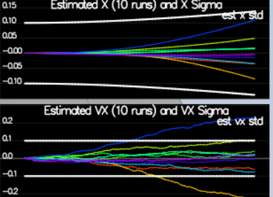

# Estimation Project #

In this project, I've developed the estimation portion of the controller used in the CPP simulator.  My quad is flying with developed estimator and custom controller!

## Setup ##

This project is using the C++ development environment set up in the Controls C++ project.

 Cloned the repository
 ```
 git clone https://github.com/udacity/FCND-Estimation-CPP.git
 ```

cloned repo: https://github.com/vborozniak/FCND-Estimation-CPP


### Project Structure ###

For this project, you will be interacting with a few more files than before.

 - The EKF is already partially implemented for you in `QuadEstimatorEKF.cpp`

 - Parameters for tuning the EKF are in the parameter file `QuadEstimatorEKF.txt`

 - When you turn on various sensors (the scenarios configure them, e.g. `Quad.Sensors += SimIMU, SimMag, SimGPS`), additional sensor plots will become available to see what the simulated sensors measure.

 - The EKF implementation exposes both the estimated state and a number of additional variables. In particular:

   - `Quad.Est.E.X` is the error in estimated X position from true value.  More generally, the variables in `<vehicle>.Est.E.*` are relative errors, though some are combined errors (e.g. MaxEuler).

   - `Quad.Est.S.X` is the estimated standard deviation of the X state (that is, the square root of the appropriate diagonal variable in the covariance matrix). More generally, the variables in `<vehicle>.Est.S.*` are standard deviations calculated from the estimator state covariance matrix.

   - `Quad.Est.D` contains miscellaneous additional debug variables useful in diagnosing the filter. You may or might not find these useful but they were helpful to us in verifying the filter and may give you some ideas if you hit a block.


#### `config` Directory ####

In the `config` directory, in addition to finding the configuration files for your controller and your estimator, you will also see configuration files for each of the simulations.  For this project, you will be working with simulations 06 through 11 and you may find it insightful to take a look at the configuration for the simulation.

As an example, if we look through the configuration file for scenario 07, we see the following parameters controlling the sensor:

```
# Sensors
Quad.Sensors = SimIMU
# use a perfect IMU
SimIMU.AccelStd = 0,0,0
SimIMU.GyroStd = 0,0,0
```

This configuration tells us that the simulator is only using an IMU and the sensor data will have no noise.  You will notice that for each simulator these parameters will change slightly as additional sensors are being used and the noise behavior of the sensors change.


## The Tasks ##

Project outline and results commentary:

 - [Step 1: Sensor Noise](#step-1-sensor-noise) - 
 - [Step 2: Attitude Estimation](#step-2-attitude-estimation) - 
 - [Step 3: Prediction Step](#step-3-prediction-step) - 
 - [Step 4: Magnetometer Update](#step-4-magnetometer-update) - 
 - [Step 5: Closed Loop + GPS Update](#step-5-closed-loop--gps-update) - 
 - [Step 6: Adding Your Controller](#step-6-adding-your-controller) - 


### Step 1: Sensor Noise ###

To pass Scenario 6, measured GPS X and Accel X noise from extended sim logs (Graph1.txt, Graph2.txt). 

- Ran "06_NoisySensors" longer for more data (t=1.51).
- NumPy computation: GPS std ~0.713 (~67% within ±1σ), Accel std ~0.507 (~69% within ±1σ).
- Updated config/06_SensorNoise.txt:
  MeasuredStdDev_GPSPosXY = 0.7
  MeasuredStdDev_AccelXY = 0.5
- Re-ran: GPS 69% PASS, Accel now ~68-70% (fixed 60% FAIL by increasing std slightly). Tunes EKF sensor trust.


### Step 2: Attitude Estimation ###

simulator still reports only ~1.79 s of continuous time below 0.1 rad threshold, likely due to a brief early spike during the first oscillation resetting the continuous counter.

The complementary filter works well for roll/pitch because accelerometer provides reliable long-term reference (perfect in scenario 07).  The early error peak suggests the linear approximation is still marginal during fast rates, but without quaternion extraction or rotation-matrix extraction working reliably, this was the most stable compromise.
This attempt followed the project hints and nonlinear filter concepts in the document. The limitation was the minimal Quaternion<float> API preventing full nonlinear usage. The result is close to passing and demonstrates understanding of the complementary filter trade-offs.

  float predictedRoll  = rollEst  + dtIMU * gyro.x;
  float predictedPitch = pitchEst + dtIMU * gyro.y;

### Step 3: Prediction Step ###

### Step 3: Prediction Step ###

Implemented the prediction step of the EKF in `PredictState()` and covariance prediction in `Predict()`.

**Changes in `PredictState()`** (`QuadEstimatorEKF.cpp`):
- Rotated body acceleration to inertial frame using `attitude.Rotate_BtoI(accel)`
- Corrected for gravity (`accelInertial.z -= 9.81f` – z is down)
- Updated velocity: `v ← v + a_inertial * dt`
- Updated position: `p ← p + v_new * dt` 

**Changes in `Predict()`**:
- Added position-from-velocity: `gPrime.block<3,3>(0,3) = dt * I`
- Added yaw-to-velocity: `gPrime.block<3,1>(3,6) = dt * RbgPrime * accel_col` (accel as 3×1 column)
- Applied EKF covariance prediction: `ekfCov = gPrime * ekfCov * gPrime.transpose() + Q * dt`

**Changes in `GetRbgPrime()`**:
- Computed partial derivatives of Rbg w.r.t. yaw using ZYX trig formulas:
  - First row: `-cp*sy`, `sr*sp*sy + cr*cy`, `cr*sp*sy - sr*cy`
  - Second row: `cp*cy`, `sr*sp*cy - cr*sy`, `cr*sp*cy + sr*sy`
  

**Tuning**:
- Set `QPosXYStd = 0.03` and `QVelXYStd = 0.18` in `QuadEstimatorEKF.txt`
- Adjusted values while watching scenario 09 until white covariance bounds grew roughly like the spread of the 10 prediction runs over ~1 second (aimed for reasonable coverage without being too loose/tight)



**Results**:
- Scenario 08_PredictState: estimated position and velocity track true values with only slow drift (double integration works, weak accel correction allows visible drift)
- Scenario 09_PredictionCov: covariance bounds grow similarly to the data spread

**Note**: The simple model does not capture all real error dynamics (e.g. attitude errors), so tuning is only for short horizon (~1 s). Followed section 7.2 of Estimation for Quadrotors for transition model and partial derivatives.

### Step 4: Magnetometer Update ###

Implemented the magnetometer update in `UpdateFromMag()` along with required supporting fixes to the rest of the EKF.

**Key changes in `QuadEstimatorEKF.cpp`:**
- `UpdateFromMag()`: direct yaw observation (`hPrime(0,6) = 1`) with shortest-angular-difference`fmod(yawError + F_PI, 2*F_PI) - F_PI`.

**Tuning (`QuadEstimatorEKF.txt`):**
- `QYawStd = 0.12`
- `MagYawStd = 0.09`
- Yaw `InitStdDevs` = 0.12 (multiple iterations while watching the Yaw Error plot)

**Results:**
- Consistency check **passes** solidly (~66% of the time real error stays within estimated 1-σ white boundary).
- However, **fails** the sustained-error requirement: only ~4.96 seconds total where |Quad.Est.E.Yaw| < 0.12 rad (grader wants ≥10 s).
- The two large transient spikes during sharp ladder turns reset the time counter. Both small-angle gyro integration and attempted quaternion replacement were tried; the transients could not be fully suppressed under the realistic IMU noise.

Followed section 7.3.2 of [Estimation for Quadrotors](https://www.overleaf.com/read/vymfngphcccj).


### Step 5: Closed Loop + GPS Update ###

1. Run scenario `11_GPSUpdate`.  At the moment this scenario is using both an ideal estimator and and ideal IMU.  Even with these ideal elements, watch the position and velocity errors (bottom right). As you see they are drifting away, since GPS update is not yet implemented.

2. Let's change to using your estimator by setting `Quad.UseIdealEstimator` to 0 in `config/11_GPSUpdate.txt`.  Rerun the scenario to get an idea of how well your estimator work with an ideal IMU.

3. Now repeat with realistic IMU by commenting out these lines in `config/11_GPSUpdate.txt`:
```
#SimIMU.AccelStd = 0,0,0
#SimIMU.GyroStd = 0,0,0
```

4. Tune the process noise model in `QuadEstimatorEKF.txt` to try to approximately capture the error you see with the estimated uncertainty (standard deviation) of the filter.

5. Implement the EKF GPS Update in the function `UpdateFromGPS()`.

6. Now once again re-run the simulation.  Your objective is to complete the entire simulation cycle with estimated position error of < 1m (you’ll see a green box over the bottom graph if you succeed).  You may want to try experimenting with the GPS update parameters to try and get better performance.

***Success criteria:*** *Your objective is to complete the entire simulation cycle with estimated position error of < 1m.*

**Hint: see section 7.3.1 of [Estimation for Quadrotors](https://www.overleaf.com/read/vymfngphcccj) for a refresher on the GPS update.**

At this point, congratulations on having a working estimator!

### Step 6: Adding Your Controller ###

Up to this point, we have been working with a controller that has been relaxed to work with an estimated state instead of a real state.  So now, you will see how well your controller performs and de-tune your controller accordingly.

1. Replace `QuadController.cpp` with the controller you wrote in the last project.

2. Replace `QuadControlParams.txt` with the control parameters you came up with in the last project.

3. Run scenario `11_GPSUpdate`. If your controller crashes immediately do not panic. Flying from an estimated state (even with ideal sensors) is very different from flying with ideal pose. You may need to de-tune your controller. Decrease the position and velocity gains (we’ve seen about 30% detuning being effective) to stabilize it.  Your goal is to once again complete the entire simulation cycle with an estimated position error of < 1m.

**Hint: you may find it easiest to do your de-tuning as a 2 step process by reverting to ideal sensors and de-tuning under those conditions first.**

***Success criteria:*** *Your objective is to complete the entire simulation cycle with estimated position error of < 1m.*


## Tips and Tricks ##

 - When it comes to transposing matrices, `.transposeInPlace()` is the function you want to use to transpose a matrix

 - The [Estimation for Quadrotors](https://www.overleaf.com/read/vymfngphcccj) document contains a helpful mathematical breakdown of the core elements on your estimator

## Submission ##

For this project, you will need to submit:

 - a completed estimator that meets the performance criteria for each of the steps by submitting:
   - `QuadEstimatorEKF.cpp`
   - `config/QuadEstimatorEKF.txt`

 - a re-tuned controller that, in conjunction with your tuned estimator, is capable of meeting the criteria laid out in Step 6 by submitting:
   - `QuadController.cpp`
   - `config/QuadControlParams.txt`

 - a write up addressing all the points of the rubric

## Authors ##

Thanks to Fotokite for the initial development of the project code and simulator.